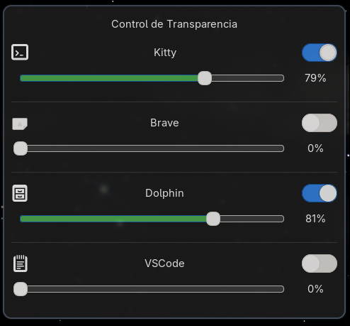

# Transparencia GTK

Aplicación para **controlar la transparencia de ventanas en Hyprland** mediante una interfaz gráfica sencilla construida en **Python + GTK**.

## ✨ Características

- **Control de transparencia** de ventanas en tiempo real para aplicaciones específicas.
- Interfaz gráfica amigable con **GTK 3**.
- Soporte para múltiples aplicaciones: Kitty, Brave, WhatsApp, X (Twitter), YouTube, Dolphin y VSCode.
- Detección automática de **Hyprland** y aplicación de reglas persistentes.
- Guardado automático de configuración en `~/.config/ventana_gtk/transparencias.json`.
- Aplicación inmediata de transparencia a ventanas activas.
- Código abierto y extensible para personalización.

## 📁 Estructura del proyecto

- `ventana.py`: Lógica principal de la ventana GTK y aplicación de transparencia.
- `test_ventana.py`: Script de prueba para la interfaz.
- `estilo.css`: Estilos visuales de la aplicación.
- `transparencias.json`: Configuración guardada automáticamente (no se incluye en el repo).

## ⚙️ Requisitos

- **Hyprland** instalado y funcionando.
- **Python 3.10+**
- **GTK 3** y dependencias de desarrollo:
  ```bash
  sudo pacman -S python-gobject gtk3  # Arch Linux
  # o en Debian/Ubuntu:
  sudo apt install python3-gi gir1.2-gtk-3.0
  ```

## 🚀 Instalación y uso

### Opción 1: Ejecución directa (rápida)

Clona el repositorio y ejecuta la app:
```bash
git clone https://github.com/Brextal/transparencia-gtk.git
cd transparencia-gtk
python3 ventana.py
```

### Opción 2: Instalación completa (para lanzadores como rofi)

Sigue estos pasos para que la app aparezca en tu lanzador (rofi, dmenu, etc.) y sea accesible desde terminal:

1. Clona el repositorio:
   ```bash
   git clone https://github.com/Brextal/transparencia-gtk.git
   cd transparencia-gtk
   ```

2. (Opcional) Verifica permisos de ejecución:
   ```bash
   chmod +x transparencia
   ```

3. Crea un enlace simbólico en `~/.local/bin`:
   ```bash
   ln -sf "$(pwd)/transparencia" ~/.local/bin/transparencia
   ```
   > 💡 Asegúrate de que `~/.local/bin` esté en tu `PATH`:
   > ```bash
   > echo 'export PATH="$HOME/.local/bin:$PATH"' >> ~/.bashrc
   > ```

4. Crea el archivo `.desktop` para lanzadores:
   ```bash
   cat > ~/.local/share/applications/transparencia.desktop << 'EOF'
   [Desktop Entry]
   Name=Transparencia GTK
   Comment=Control de transparencia de ventanas en Hyprland
   Exec=transparencia
   Icon=transparencia
   Terminal=false
   Type=Application
   Categories=Utility;
   StartupNotify=true
   StartupWMClass=ventanaGTK
   Keywords=transparency;alpha;hyprland;window;
   EOF
   ```

5. Actualiza la caché de aplicaciones:
   ```bash
   update-desktop-database ~/.local/share/applications 2>/dev/null || true
   ```

Ajusta la transparencia de tus ventanas directamente desde la interfaz:
1. Activa el interruptor (switch) para la aplicación deseada.
2. Desliza el control para ajustar el nivel de transparencia.
3. La configuración se guarda automáticamente y se aplica al instante.



### 🔄 Actualizar

Para obtener los últimos cambios:
```bash
cd transparencia-gtk
git pull
```
Los cambios se reflejarán automáticamente (el symlink apunta al script del repo).

## 🎯 Aplicaciones soportadas

| Aplicación | Tipo de coincidencia | Identificador |
|-----------|---------------------|---------------|
| Kitty | class | `kitty` |
| Brave | class | `brave-browser` |
| WhatsApp | class | `brave-web.whatsapp.com__-Default` |
| X (Twitter) | title (regex) | `.*X.*` |
| YouTube | title (regex) | `.*YouTube.*` |
| Dolphin | class | `org.kde.dolphin` |
| VSCode | class | `code` |

## 🔧 Configuración de Hyprland

Para abrir WhatsApp y otras apps web como apps independientes, añade a tu `~/.config/hypr/binds.conf`:

```bash
bind = $mainMod, W, exec, brave --app=https://web.whatsapp.com/    # Abrir WhatsApp
bind = $mainMod, Y, exec, brave --app=https://www.youtube.com    # Abrir YouTube
bind = $mainMod, X, exec, brave --app=https://x.com/home    # Abrir X/Twitter
```

## 🤝 Contribuciones

Las contribuciones son bienvenidas.

- Haz un **fork** del proyecto.
- Crea una rama con tu mejora:
  ```bash
  git checkout -b mi-mejora
  ```
- Envía un pull request.

## 📜 Licencia

Este proyecto está bajo la licencia MIT, lo que permite su uso, modificación y distribución libremente.
